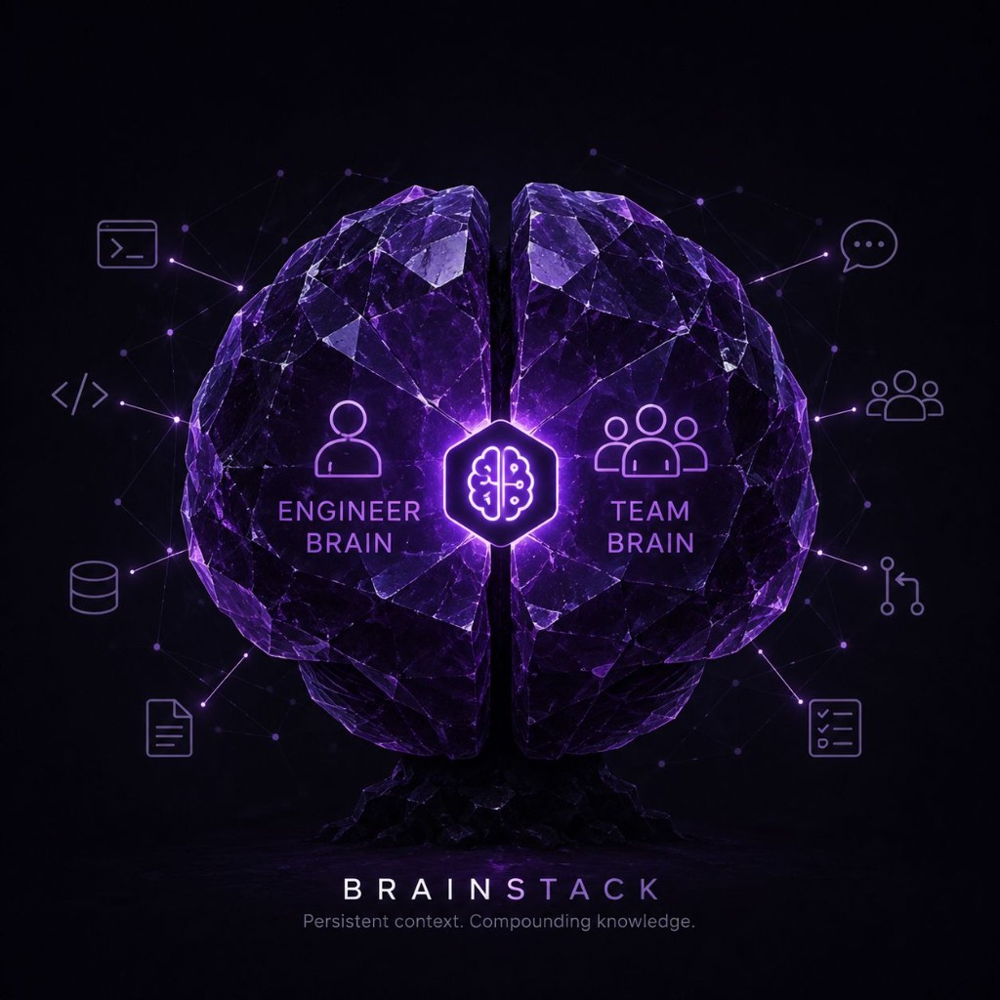
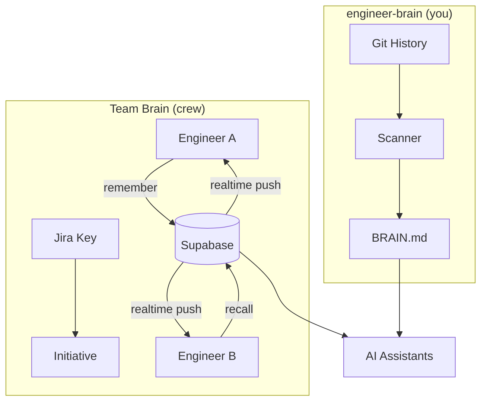
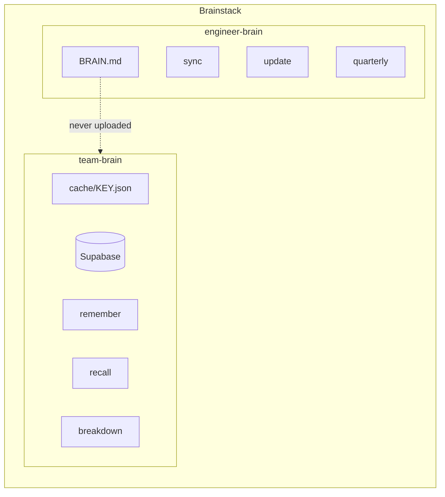
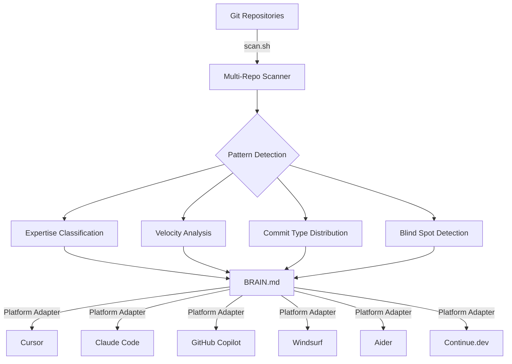
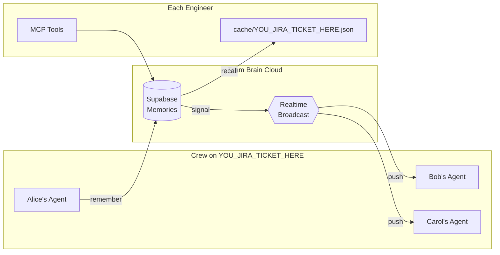
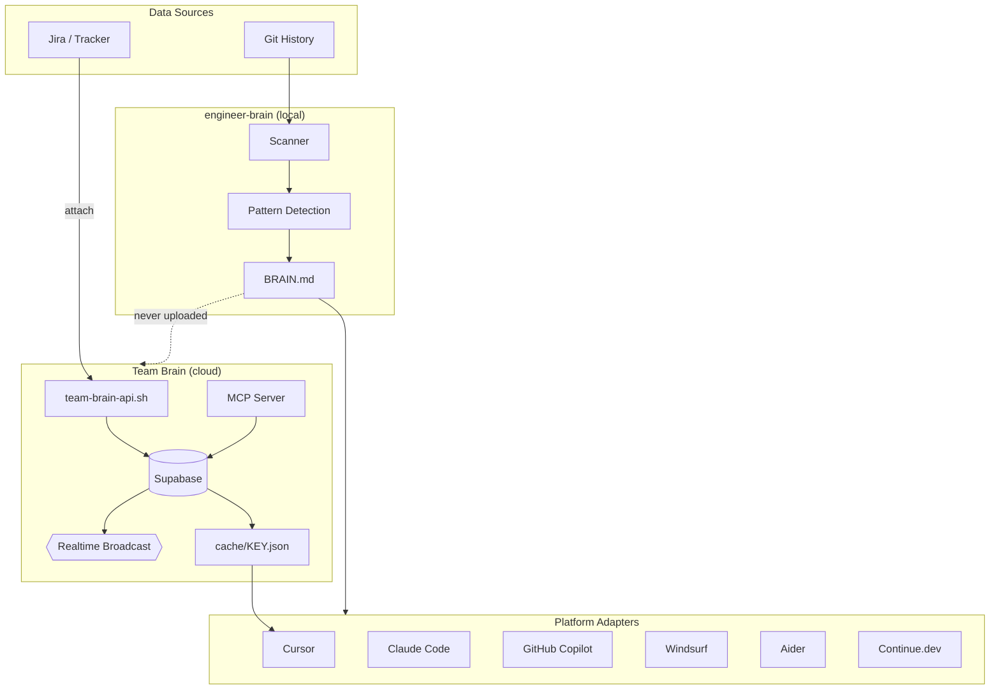

<p align="center">
  
</p>

<p align="center">
  <h1 align="center">Brainstack</h1>
  <p align="center">
    <strong>Persistent context for AI coding assistants — personal and team.</strong>
  </p>
  <p align="center">
    <code>engineer-brain</code> for you &nbsp;·&nbsp; <code>team-brain</code> for your crew
  </p>
  <p align="center">
    <a href="https://github.com/Hrithik-Gavankar/brainstack/blob/main/LICENSE"></a>
    <a href="https://github.com/Hrithik-Gavankar/brainstack/stargazers"></a>
    <a href="https://github.com/Hrithik-Gavankar/brainstack/issues"></a>
    
    
  </p>
</p>

<p align="center">
  <a href="#quick-start">Quick Start</a> •
  <a href="#two-scopes-one-product">Two Scopes</a> •
  <a href="#engineer-brain">engineer-brain</a> •
  <a href="#team-brain">Team Brain</a> •
  <a href="docs/architecture.md">Architecture</a> •
  <a href="docs/team-brain-onboarding.md">Team Onboarding</a> •
  <a href="docs/engineer-brain-onboarding.md">engineer-brain Setup</a> •
  <a href="docs/roadmap.md">Roadmap</a> •
  <a href="docs/faq.md">FAQ</a>
</p>

---

## The Problem

AI coding assistants understand code. They don't understand *engineers* — or *teams*.

**Personal context is lost.** Every session starts from zero. Your AI doesn't know your expertise, your active projects, or your career trajectory. You re-explain context dozens of times a day.

**Team knowledge stays siloed.** When three engineers spike the same Jira initiative, each AI assistant starts fresh. Research is duplicated. Decisions are forgotten. Context lives in Slack threads that nobody can find.

Prompts are ephemeral. Chat history is tool-locked. System instructions go stale. Team learnings evaporate.

**Engineering context should be portable, persistent, and shared when it matters.**

---

## The Solution

Brainstack is a **context layer** for AI coding assistants — with two scopes:

| Scope | What it solves | Living document |
|-------|----------------|-----------------|
| **`engineer-brain`** | Personal context — your skills, patterns, career | `BRAIN.md` (local) |
| **Team Brain** | Crew context — shared memory on a Jira initiative | Supabase + local cache |



It's not another AI tool. It's what makes every AI tool smarter — for you and your team.

---

## Two Scopes, One Product



| | `engineer-brain` | Team Brain |
|--|----------------|------------|
| **For** | You | Your crew on a Jira initiative |
| **Stores** | `BRAIN.md` (local, versioned) | Supabase memories + local cache |
| **Syncs** | Never (stays private) | Realtime push to peers |
| **Typical use** | Standups, quarterly reviews, growth tracking | Spike research, shared decisions, onboarding context |

**Principle:** Personal brain stays personal. Team brain is opt-in, crew-visible, and tied to a Jira key.

---

## Why Brainstack Exists

| Without Brainstack | With Brainstack |
|---------------|------------|
| Re-explain your stack every session | AI loads your full profile automatically |
| Generic suggestions that ignore your expertise | Responses tailored to your skill level and goals |
| Standups written from memory | Paste-ready standups generated from git history |
| Quarterly reviews are a scramble | Structured reviews with real metrics, auto-generated |
| Context locked inside one tool | Same brain across 6+ platforms |
| Team research duplicated across engineers | Shared memory — Engineer A learns, Engineer B knows |
| Spike decisions lost in Slack threads | Durable memories tied to Jira keys |

---

## Personal scope (`engineer-brain`)

Your personal engineering profile — skills, patterns, career trajectory — that follows you across AI tools.



**Three layers:**

1. **Scanner** — Collects raw data from your git history across all repositories
2. **BRAIN.md** — A living Markdown document that structures your engineering identity
3. **Adapters** — Platform-specific context files that feed your brain into each AI tool

---

## Team Brain

Shared AI memory for crews working on the same Jira initiative. When one engineer's agent learns something, everyone's agent knows it — in realtime.



### Key Features

| Feature | What it does |
|---------|--------------|
| **Realtime sync** | `remember` → instant push to peer agents (no polling) |
| **Merge-safe updates** | Same `source_ref` + new body = update, not duplicate |
| **Learning loop** | Human corrections become durable memory |
| **Role-based access** | `admin` / `member` / `viewer` with invite rotation |
| **Rate limits** | Per-member, per-team, per-initiative guardrails |
| **MCP integration** | `attach`, `remember`, `recall`, `breakdown` tools |
| **Repo pin** | Commit `project.json` (no secrets) for portable crew config |

### How It Works

1. **Admin creates team** — `register "Team Atlas" "Alice"` → Supabase project + invite code
2. **Teammates join** — `onboard <invite> "Bob" YOU_JIRA_TICKET_HERE` → credentials + Jira key
3. **Start sync mode** — "I'm starting on YOU_JIRA_TICKET_HERE — start Team Brain sync"
4. **Agents collaborate** — `remember` findings → peers get realtime push → `recall` when needed
5. **Generate artifacts** — `breakdown YOU_JIRA_TICKET_HERE` → story/spike draft from crew memory

```
Alice researches auth options → remember "prefer OAuth2 over SAML for SSO"
    ↓ (instant)
Bob's agent knows → suggests OAuth2 without re-researching
    ↓
Carol runs breakdown → draft includes Alice's auth decision
```

> **Docs:** [Team Brain Overview](docs/team-brain.md) · [Team Onboarding](docs/team-brain-onboarding.md) · [engineer-brain Setup](docs/engineer-brain-onboarding.md) · [Tutorial](docs/team-brain-tutorial.md) · [Demo](docs/team-brain-demo.md)

---

## What Is BRAIN.md?

`BRAIN.md` is to engineers what `README.md` is to projects.

It's a structured Markdown file that documents *you* — your skills, your work patterns, your active projects, your growth trajectory. It's designed to be consumed by AI assistants, providing them deep context about the human they're helping.

```markdown
# Jane Doe — Engineering Profile

## Identity
- Name: Jane Doe
- Role: Senior Backend Engineer, Payments Team, Stripe
- Experience: 7 years
- Goal: Staff Engineer

## Expertise Map
### Strong
- Distributed systems (designed payment routing at scale)
- Go, Python, PostgreSQL
### Growing
- Kubernetes operator development
- Team leadership

## Work Patterns
- Peak hours: 9AM–1PM PST
- Style: Test-first, small PRs, security-conscious
- Fix-to-feature ratio: 35% fix, 45% feat, 20% refactor

## Current Sprint
- Active: payment-retry-redesign (branch: feat/retry-v2)
- Reviewing: PR #892 (rate limiter changes)
```

> Read the full specification: **[docs/brain-spec.md](docs/brain-spec.md)**

---

## Full Architecture



| Layer | `engineer-brain` | Team Brain |
|-------|----------------|------------|
| **Data source** | Git history | Jira identity + agent findings |
| **Storage** | `BRAIN.md` (local) | Supabase (cloud) + `cache/` (local) |
| **Sync** | None (private) | Realtime push + poll fallback |
| **Delivery** | Platform adapters | MCP tools + Cursor skill |

> Full architecture documentation: **[docs/architecture.md](docs/architecture.md)**

---

## Platform Support

Both scopes work with every major AI coding assistant. Same brain, native format.

| Platform | `engineer-brain` | Team Brain | Status |
|----------|----------------|------------|--------|
| [Cursor](https://cursor.sh) | `.cursor/rules/engineer-brain.mdc` | `team-brain.mdc` + MCP | ✅ Full support |
| [Claude Code](https://claude.ai/code) | `CLAUDE.md` | MCP tools | ✅ Supported |
| [GitHub Copilot](https://github.com/features/copilot) | `.github/copilot-instructions.md` | CLI | ✅ Supported |
| [Windsurf](https://codeium.com/windsurf) | `.windsurfrules` | CLI | ✅ Supported |
| [Aider](https://aider.chat) | `CONVENTIONS.md` | CLI | ✅ Supported |
| [Continue.dev](https://continue.dev) | `.continue/rules.md` | CLI | ✅ Supported |
| [Zed](https://zed.dev) | — | — | 🗓️ Planned |
| [JetBrains AI](https://www.jetbrains.com/ai/) | — | — | 🗓️ Planned |

> **Note:** Cursor has the richest Team Brain integration (always-on rules + MCP + skills). Other platforms use CLI + manual recall.

## Features

### `engineer-brain` commands

| Command | Description |
|---------|-------------|
| `engineer-brain sync` | Generate paste-ready standup notes from git history |
| `engineer-brain update` | Refresh BRAIN.md with latest commits, patterns, and metrics |
| `engineer-brain quarterly` | Generate structured quarterly review with impact numbers |
| `engineer-brain reflect` | Pattern analysis: blind spots, habits, recommendations |
| `engineer-brain scan [days]` | Raw multi-repo git scan (add `--json` for structured output) |
| `engineer-brain doctor` | Brain health check with completeness score and growth suggestions |

### Team Brain commands

| Command | Description |
|---------|-------------|
| `team-brain onboard` / `register` / `join` | Invite join or create a team (Supabase) |
| `team-brain start` / `stop` / `wake` / `touch` | **Sync mode** — one entry, background pull, idle sleep |
| `team-brain attach <JIRA-KEY>` | Jira identity → initiative + pull memories into cache |
| `team-brain remember` / `recall` | Write / search shared memories (merge-safe `source_ref`) |
| `team-brain breakdown <KEY>` | Recall → story/spike draft (`*-breakdown.md`) |
| `team-brain sync-status` / `metrics` / `metrics --team` | Session state; local reuse; crew aggregation (#35) |
| `team-brain sync` / `capture` / `watch` | Lower-level pull / aliases |
| `team-brain status` / `whoami` | Config + membership |

### Intelligence

- **Auto-expertise classification** — Strong / Growing / Exposure based on commit frequency
- **Pattern detection** — Fix-heavy mode, cooling repos, stale goals, velocity drops
- **Monday-aware standups** — Looks back 3 days on Mondays, skips weekends
- **Blocker detection** — Merge conflicts, CI failures, stale branches
- **Growth coaching** — AI nudges you toward career goals, not just code completion

### Safety

- Never commits without explicit permission
- Never pushes without explicit permission
- Never force-pushes under any circumstance
- Always asks before destructive operations

---

## Quick Start

### Install

```bash
git clone https://github.com/Hrithik-Gavankar/brainstack.git
cd brainstack
bash install.sh <platform> [workspace_path]
```

### Platforms

```bash
bash install.sh cursor ~/my-workspace
bash install.sh claude-code ~/my-workspace
bash install.sh vscode-copilot ~/my-workspace
bash install.sh windsurf ~/my-workspace
bash install.sh aider ~/my-workspace
bash install.sh continue-dev ~/my-workspace
```

### Configure

1. Edit the installed context file — fill in your name, role, skills, and career context
2. Edit the scanner config — set your workspace path and git author pattern
3. Run `engineer-brain update` in your AI assistant — it auto-populates BRAIN.md from your git history

### Use

```
"engineer-brain sync"        → before standup
"engineer-brain reflect"     → Friday afternoons
"engineer-brain update"      → start of each month
"engineer-brain quarterly"   → before performance reviews

"team-brain onboard <invite> Name KEY" → new joiner (one command)
"team-brain register …"                → admin creates team once

# Sync mode (Cursor chat — one line to start crew work):
"I'm starting on YOU_JIRA_TICKET_HERE — start Team Brain sync."
"Wake Team Brain sync for YOU_JIRA_TICKET_HERE and continue."
"Stop Team Brain sync for YOU_JIRA_TICKET_HERE."
"Breakdown YOU_JIRA_TICKET_HERE from Team Brain memory."
```


### Demo (Cursor) — personal + team

```bash
bash install.sh cursor ~/my-workspace
# Personal: /engineer-brain sync
# Admin once: bash core/scripts/team-brain-api.sh register "Team Atlas" "You"
# Teammate:   bash core/scripts/team-brain-api.sh onboard <INVITE> "Name" YOU_JIRA_TICKET_HERE
# (Admin: own Supabase project → fill local project.public.env; joiners get URL+anon+invite)
# Then in Cursor: I'm starting on YOU_JIRA_TICKET_HERE — start Team Brain sync.
```

---

## Project Structure

```
brainstack/
├── README.md                          # You are here
├── LICENSE                            # MIT
├── CONTRIBUTING.md                    # Contribution guidelines
├── CODE_OF_CONDUCT.md                 # Community standards
├── CHANGELOG.md                       # Release history
├── install.sh                         # Universal installer
│
├── core/                              # Platform-agnostic engine
│   ├── BRAIN.md                       # Personal living document template
│   ├── COMMANDS.md                    # Engineer-brain command definitions
│   ├── CONTEXT.md                     # Context rule template
│   ├── team/                          # Team Brain templates + commands
│   │   ├── TEAM.md
│   │   ├── team.yaml.example
│   │   ├── TEAM_COMMANDS.md
│   │   └── initiatives/_TEMPLATE.md
│   └── scripts/
│       ├── scan.sh                    # Multi-repo git scanner (text + --json) |
│       ├── doctor.sh
│       ├── team-init.sh               # Scaffold .team-brain/
│       └── team-brain-api.sh          # Supabase RPC client
│
├── supabase/                          # Team Brain cloud (migrations + public env)
├── mcp/team-brain/                    # Team Brain MCP (attach / remember / recall / breakdown)
│
├── platforms/                         # Platform-specific adapters
│   ├── cursor/                        # engineer + team rules/skills (agent loop)
│   ├── claude-code/
│   ├── vscode-copilot/
│   ├── windsurf/
│   ├── aider/
│   └── continue-dev/
│
├── docs/                              # Documentation
│   ├── architecture.md
│   ├── scopes.md                      # Umbrella: engineer + team skills
│   ├── team-brain.md                  # Team Brain overview
│   ├── team-brain-onboarding.md       # Junior join path
│   ├── engineer-brain-onboarding.md   # Standup signals (gh + Atlassian MCP)
│   ├── team-brain-memory.md           # Collaborative memory plan (P0–P4)
│   ├── brain-spec.md
│   ├── vision.md
│   ├── roadmap.md
│   └── faq.md
│
├── dashboard/                         # Web dashboard (local + demo viz)
│   ├── README.md                      # Hosting/privacy + data-port docs
│   └── src/                           # React + Vite app
│
├── website/                           # Product docs site (Docusaurus)
│
├── examples/                          # Example profiles
│   ├── backend-engineer/              # Personal BRAIN.md examples
│   ├── …/
│   └── team-spike-crew/               # Team Brain demo fixture
│
├── templates/                         # Starter templates
│   └── BRAIN.md
│
└── .github/                           # GitHub configuration
    ├── ISSUE_TEMPLATE/
    ├── workflows/
    └── PULL_REQUEST_TEMPLATE.md
```

### Web dashboard

Visualize patterns locally, or open the **sample-data demo** on GitHub Pages:

**Live demo:** https://hrithik-gavankar.github.io/brainstack/

```bash
cd dashboard && npm install && npm run dev
```

See **[dashboard/README.md](dashboard/README.md)** for the data-port design and hosting rules. Do not deploy personal `BRAIN.md` to a public host.

---

## Roadmap

See **[docs/roadmap.md](docs/roadmap.md)** for the full roadmap.

**Near-term:**
- [x] `engineer-brain doctor` — health check and brain completeness score
- [x] Web dashboard MVP (`dashboard/`) — sample data + data-port seam; BRAIN.md parser next
- [x] Scanner JSON output (`scan.sh --json`, #3) — structured contract for dashboard/CI
- [x] Team Brain collaborative memory — Jira + Supabase SoT + cache + MCP + agent loop
- [x] Team Brain onboarding — invite + Jira key (`onboard`)
- [x] Team aggregation metrics (coverage + reuse via `metrics --team` — #35; collab graph deferred)

**Mid-term:**
- [ ] Zed and JetBrains platform support
- [ ] GitLab/Bitbucket integration
- [ ] Weekly email digest mode
- [x] Team Brain MCP (`mcp/team-brain/`) — remember / recall / attach / breakdown
- [ ] Engineer-brain personal MCP (BRAIN.md / sync)

**Long-term:**
- [ ] BRAIN.md ecosystem — importers, exporters, validators
- [ ] Organization-level engineering intelligence
- [ ] Open standard adoption

---

## Contributing

We welcome contributions! See **[CONTRIBUTING.md](CONTRIBUTING.md)** for guidelines.

**Quick ways to contribute:**
- Add support for a new AI platform
- Improve pattern detection heuristics
- Create example BRAIN.md profiles for different engineering roles
- Improve documentation
- Report bugs or suggest features

---

## FAQ

See **[docs/faq.md](docs/faq.md)** for the full FAQ.

**Is this another AI coding tool?**
No. Brainstack doesn't write code. It provides context to tools that do.

**Does it send my data anywhere?**
`engineer-brain` stays 100% local. Team Brain syncs to *your* Supabase project (you own the data). Personal `BRAIN.md` is never uploaded.

**Can I use it with multiple AI tools simultaneously?**
Yes. That's the point. Install once, use everywhere.

**What's the difference between `engineer-brain` and Team Brain?**
`engineer-brain` = you (personal profile, standups, career). Team Brain = your crew on a Jira initiative (shared memory, realtime sync).

**Do I need Team Brain?**
No. Brainstack works with `engineer-brain` alone. Team Brain is opt-in for crews who want shared AI context.

---

## License

MIT — use it, fork it, make it yours.

---

<p align="center">
  <strong>The future isn't smarter AI. It's AI that understands engineers — and teams.</strong>
</p>

<p align="center">
  Built by <a href="https://github.com/Hrithik-Gavankar">Hrithik Gavankar</a>
</p>
